Реєстрація та відновлення пароля в сервісі VodafoneDoc
#############################################################

.. сюда закину немного картинок для текста

.. role:: red

.. role:: underline

.. contents:: Зміст:
   :depth: 3

---------

Для початку роботи в сервісі **VodafoneDoc** потрібно здійснити авторизований вхід (https://docs.vodafone.ua/login).

.. hint::
   Для зручності можливо одразу обрати мову інтерфейсу

   .. image:: pics_VD_registration/VD_registration_002.png
      :align: center

Нові користувачі мають можливість самостійно зареєструватись (кнопка **"Створити акаунт"** (1)). Зареєстровані користувачі для **"Входу"** на платформу використовують електронну пошту та пароль (2), а для тих, хто забув пароль передбачений функціонал для його відновлення (3):

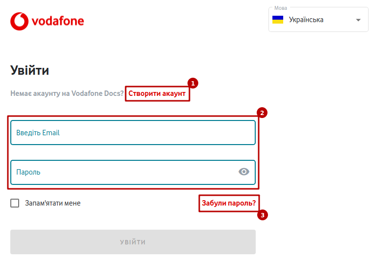

**1 Реєстрація**
================================================

Для самостійної реєстрації (https://docs.vodafone.ua/login) потрібно натиснути на кнопку **"Створити акаунт"**:

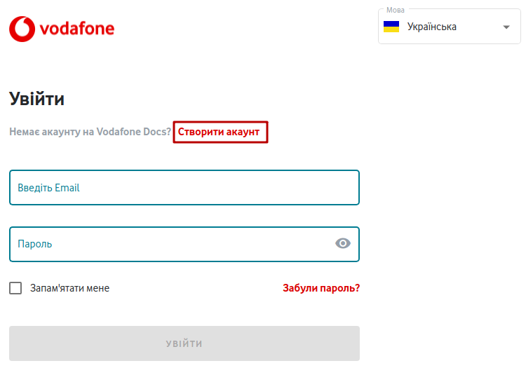

Для початку реєстрації потрібно ввести електронну пошту та натиснути на кнопку **"Отримати код для реєстрації"**:

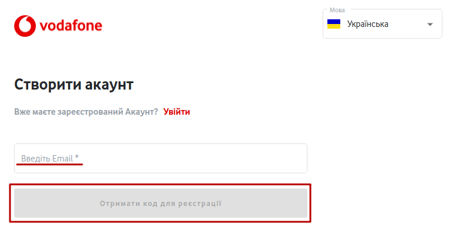

Після чого на вказану електронну адресу вже буде відправлено код підтвердження:

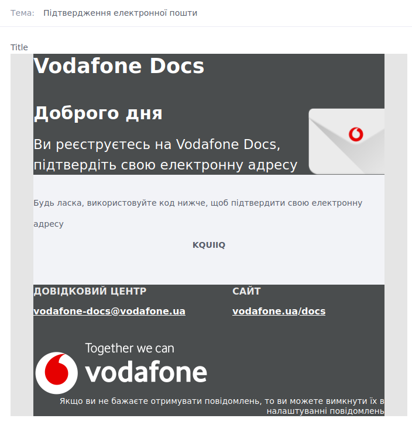

Код потрібно скопіювати та внести в поле "Введіть код отриманий на Email" та натиснути кнопку **"Продовжити"** (при введенні помилкового email можливо **"Виправити адресу електронної пошти"**): 

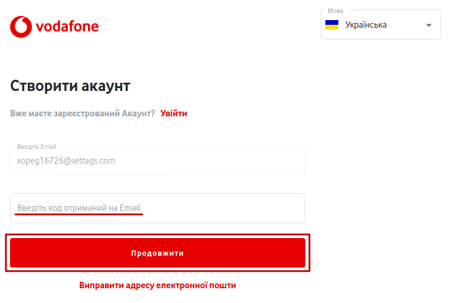

**1.1 Реєстрація особистого акаунта**
-----------------------------------------------------

При створенні (https://docs.vodafone.ua/registration) особистого акаунта обов'язково потрібно ввести ім'я, прізвище, номер телефону, пароль та натиснути кнопку **"Створити акаунт"**:

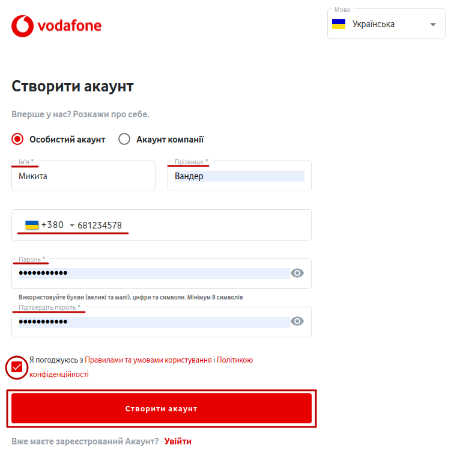

**1.2 Реєстрація акаунта компанії**
-----------------------------------------------------

При створенні (https://docs.vodafone.ua/registration) акаунта компанії також обов'язково потрібно ввести ім'я, прізвище, електронну пошту, пароль та **додатково** вказати ЄДРПОУ/ІПН і назву компанії, що буде відображатись контрагентам та натиснути кнопку **"Створити акаунт"**:

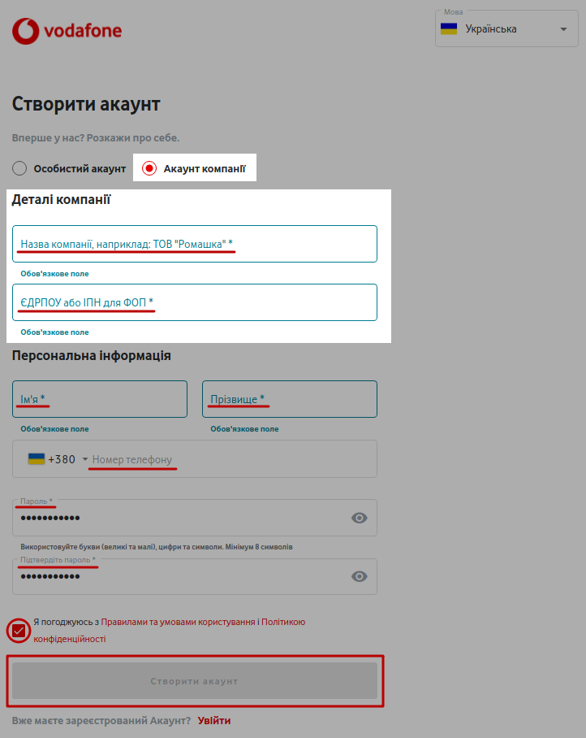

.. _pass-recovery:

**2 Відновлення пароля**
======================================

Для відновлення пароля потрібно натиснути на кнопку **"Забули пароль?"**:

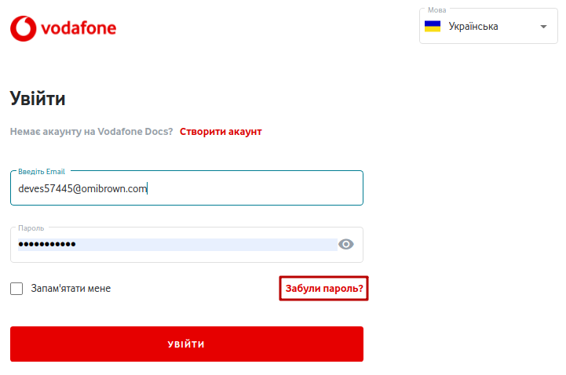

Далі в вікні ввести свою пошту (пошта повинна бути зареєстрована на платформі) та натиснути на кнопку **"Змінити пароль"** :

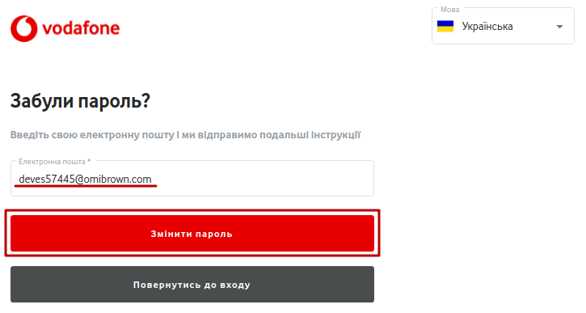

Після чого система проінформує, що відправила листа з унікальним посиланням на вказану адресу:

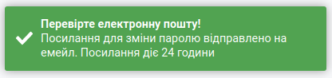

На пошту прийде лист з кнопкою **"Відновити пароль"** для переходу на форму введення нового пароля:

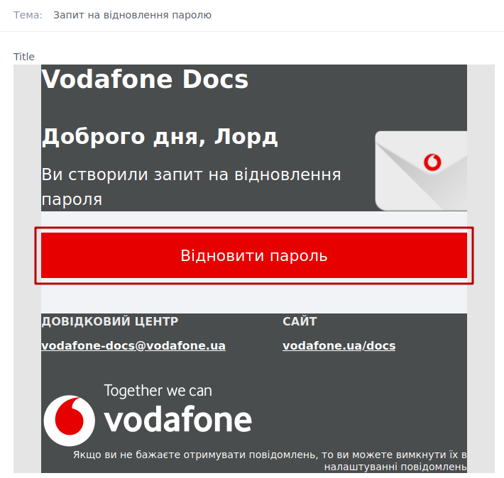

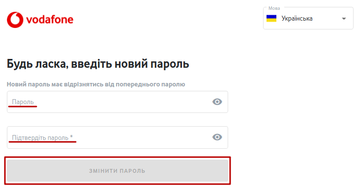

Після коректного введення нового пароля одразу можливо здійснювати авторизацію до сервісу VodafoneDoc.

------------------------------

.. [#] Мейлбокс (mailbox) — сутність, що є вхідною/вихідною точкою документообігу в сервісі. Може бути особистим або спільним для кількох користувачів на рівні одного акаунта. 

------------------------------

.. include:: /_constant/kontakti.rst
